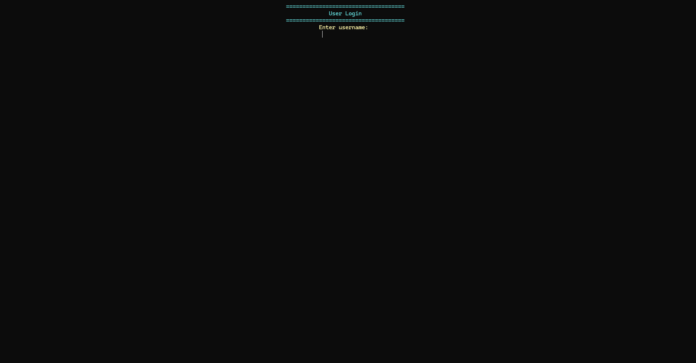
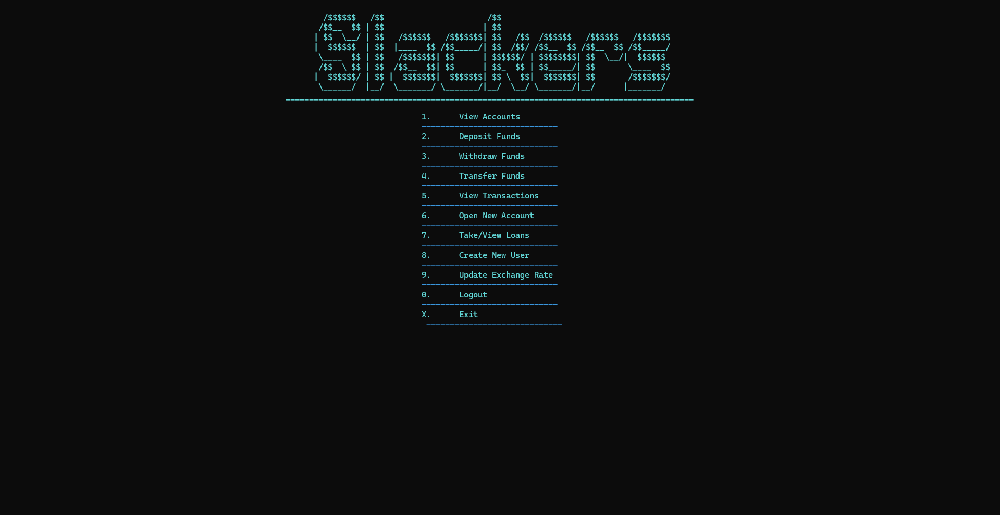

# AssetManagers_GruppProjekt
This is a C# Console app where the instructions were to make a console bank management program (kinda)

## Gruppmedlemmar: (Slackers)
Max Berglund, Fredrik Andersson, Pakapol (Zian) & Eyosias Abera

# Bank Management System

A simple bank management system built in C#. This application allows users to manage bank accounts, perform transactions, and transfer funds using a command-line interface. It supports features such as user account creation, fund withdrawals, and currency conversion for transfers.

---

 

---

## Table of Contents

- [Features](#features)
- [Getting Started](#getting-started)
  - [Prerequisites](#prerequisites)
- [Usage](#usage)
  - [Logging In](#logging-in)
  - [Main Menu Options](#main-menu-options)
  - [Account Management](#account-management)
  - [Transfers](#transfers)
- [Validation and Security](#validation-and-security)
- [Contributing](#contributing)

---

## Features

- **User Registration and Login System**
- **Account Management** (Create, View, Deposit, Withdraw)
- **Transfers Between Accounts** (Own and Other Users)
- **Transaction Management and Display**
- **Currency Conversion for Transfers**
- **Admin and Regular User Role Support**
- **Password Validation**

---

## Getting Started

### Prerequisites

- [.NET SDK](https://dotnet.microsoft.com/download) (Version 8.0 or newer)

## Usage

### Logging In

Enter your username and password to log in to the bank system. If you do not have an account, an admin can create a new user for you.

---

### Main Menu Options

After logging in, you will have access to several options, depending on your role (Admin or Regular User).

- **View Accounts**: Displays all the accounts you own along with their balance and currency.
- **Deposit Funds**: Deposits money into one of your accounts.
- **Withdraw Funds**: Withdraws money from one of your accounts, subject to balance availability.
- **Transfer Funds**: Transfers money between your accounts or to other users' accounts, with currency conversion if necessary.
- **Open a New Account**: Allows you to create a new private or savings account.
- **View Transactions**: Lists all past transactions with details such as amount, sender, and receiver accounts.
- **Update Currency Exchange Rate**: Lets an Admin account update the current exchangerate for all the currencies available.
- **Logout**: Ends your session and returns to the main menu where the user can login again.
- **Exit**: Closes the program down.

---

### Account Management

#### Open a New Account

- Choose between a **Private** or **Savings** Account.
- Select a currency (**USD**, **EUR**, **SEK**).
- Savings accounts come with a default interest rate.

#### Currencies (Admin)

- Update the values of different available currencies.
- Add/Create new currencies to the program.

#### Deposit Funds

- Select an account to deposit to.
- Enter the amount to deposit.

#### Withdraw Funds

- Select an account to withdraw from.
- Enter an amount, ensuring it does not exceed the current balance.

---

### Transfers

#### Transfer Within Your Own Accounts

- Select a source and destination account.
- Specify the amount to transfer.

#### Transfer to Another User's Account

- Enter the recipient's username.
- Select their account as the destination.
- Enter the amount to transfer.

---

## Validation and Security

- **Password Requirements**: At least 8 characters, including one uppercase letter, one lowercase letter, and one digit.
- **Input Validation**: Ensures non-empty and correctly formatted input for all actions.
- **Transaction Validity**: Prevents overdrawing accounts and handles currency conversions for transfers.

---
